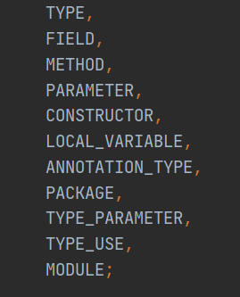
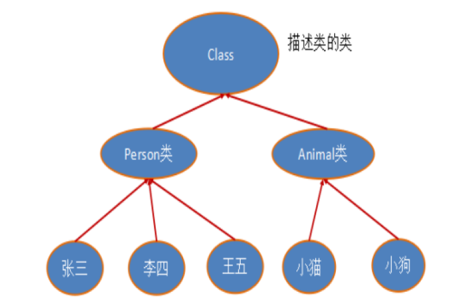
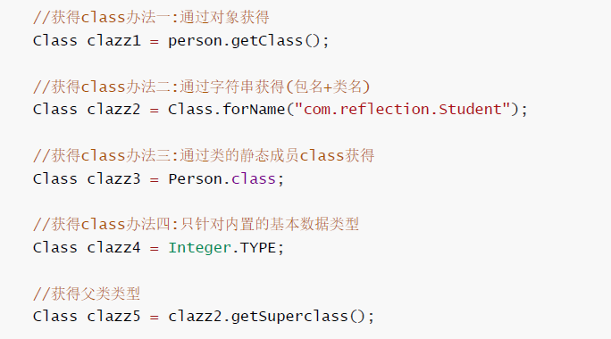
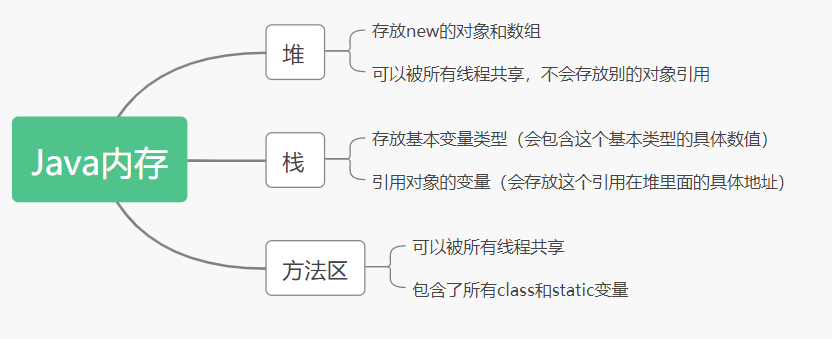
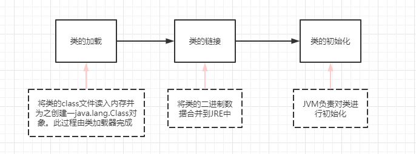
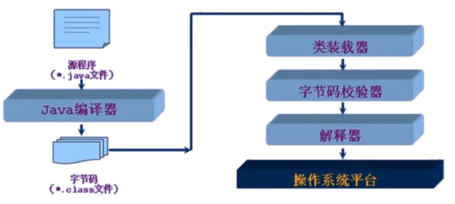
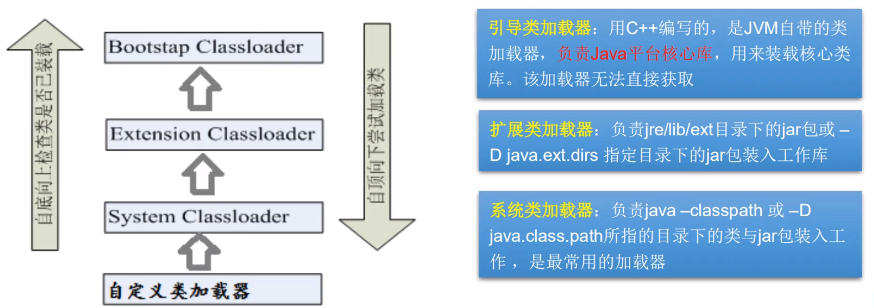
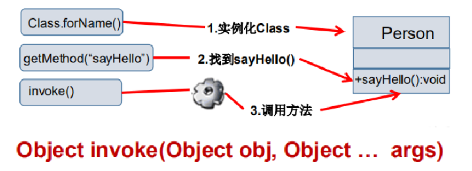

# JAVA 注解与反射


<!--more-->

# 注解与反射

> 这一章节对理解框架十分重要，包括接下来的Spring、Mybatis
>
> 文章参考以下内容，转载或引用请注明原作者和引用文章
>
> https://www.bilibili.com/video/BV1p4411P7V3

## 注解（Annotation）

### 简介

- 注解是JDK 5.0开始引入技术（Annotation）
- 注解的作用
  - 对程序作介绍（注释是对人来用的）
  - 被其他程序使用

### 内置注解
- @Override
  - 在Java.lang.Override，声明重写超类后的第二个方法，作用范围：方法
- @Deprecated
  - 作用范围：方法，属性，类
  - 表示不推荐使用此元素
- @SuppressWarnings
  - 用来抑制编译警告
  - 与前俩个不同的是，此注解需要添加一个参数
    - @SuppressWarnings("all")
    - @SuppressWarnings("unchecked")
    - @SuppressWarnings(value ={"unchecked","deprecation"})
    - .....
### 元注解

- 作用：负责注解其他注解，Java定义了四个标准类型
- 这些类型和它们所支持的类在Java.lang.Override包中可以找到 .( @Target , @Retention ,@Documented , @Inherited )
  - @Target：描述注解使用范围,所有范围如下
    - 
  - @Retention : 表示需要在什么级别保存该注释信息 , 用于描述注解的生命周期
    - (SOURCE < CLASS < RUNTIME)
  - @Document：说明该注解将被包含在Javadoc中
  - @Inherited：说明子类可以继承父类中的该注解J

### 自定义注解

- 使用 @interface自定义注解时 , 自动继承了java.lang.annotation.Annotation接口
- 分析
  - @ interface用来声明一个注解 , 格式 : public @ interface 注解名 { 定义内容 }
    - 若public不写默认为default
  - 其中的每一个方法实际上是声明了一个配置参数.
  - 方法的名称就是参数的名称.
  - 返回值类型就是参数的类型 ( 返回值只能是基本类型,Class , String , enum ).
  - **如果只有一个参数成员 , 一般参数名为value，通常这个参数名不需要在使用注解时表明**
  - 注解元素必须要有值 , 我们定义注解元素时 , 经常使用空字符串,0作为默认值 .
  - 当默认值为-1时表示不存在

```java
import java.lang.annotation.ElementType;
import java.lang.annotation.Retention;
import java.lang.annotation.RetentionPolicy;
import java.lang.annotation.Target;

public class Test3 {

    @MyAnnotation1(name = "CodeForce")
    public void test(){

    }

}

@Target({ElementType.TYPE,ElementType.METHOD})
@Retention(RetentionPolicy.RUNTIME)
@interface MyAnnotation1{
    String name() default "";
    int id() default -1 ;//-1代表不存在   等同于字符串的indexof()返回-1
    String value() default "";
 }
```

### **反射读取注解**

利用反射读取注解信息三步骤：

1. 定义注解
2. 在类中使用注解
3. 使用反射获取注解，一般此步骤都由框架集成，以下手动实现

```java
import java.lang.annotation.*;
import java.lang.reflect.Field;

public class test5 {
    public static void main(String[] args) throws ClassNotFoundException, NoSuchFieldException {
        //通过反射获取类全部信息，所有东西
        Class c1 = Class.forName("Person");
        //得到这个类的注解
        Annotation[] annotations = c1.getAnnotations();
        for (Annotation annotation : annotations) {
            System.out.println(annotation);
        }

        //获得类的注解value值
        OnTable annotation = (OnTable) c1.getAnnotation(OnTable.class);
        System.out.println(annotation.value());

        //获得类指定注解的值
        Field name = c1.getDeclaredField("name");
        OnFiled onFiled = name.getAnnotation(OnFiled.class);
        System.out.println(onFiled.columnName()+"---"+onFiled.type()+"---"+onFiled.length());

		//此方法就是通过得到信息,在JDBC生成相关SQL语句
    }

}

@OnTable("db_person")
class Person{
    @OnFiled(columnName = "db_name",type = "varchar",length = 3)
    private String name;

    public String getName() {
        return name;
    }

    public void setName(String name) {
        this.name = name;
    }

    @Override
    public String toString() {
        return "Person{" +
                "name='" + name + '\'' +
                '}';
    }
}

@Target(value = {ElementType.FIELD})
@Retention(value = RetentionPolicy.RUNTIME)
@interface OnFiled{
    String columnName(); //列名
    String type(); //类型
    int length();//长度
}

@Target(value = {ElementType.TYPE})
@Retention(value = RetentionPolicy.RUNTIME)
@interface OnTable{
   String value();//只有一个推荐使用value
}
```

## 反射（Reflection）

### 动态语言与静态语言：

- Java虽然作为静态语言，但是利用反射机制使得Java拥有部分动态语言的特性

### 反射

Reflection（反射）是Java被视为动态语言的关键，反射机制允许程序在执行期借助于Reflection API 取得任何类的内部信息，并能直接操作任意对象的内部属性及方法。

```java
Class c = Class.forName("java.util.List");
```

加载完类之后，在堆内存的方法区中就产生了一个Class类型的对象（一个类只有一个Class对象），这个对象就包含了完整的类的结构信息。我们可以通过这个对象看到类的结构。这个对象就像一面镜子，透过这个镜子看到类的结构，所以，我们形象的称之为：反射


#### Java反射提供的功能

- 在运行时判断任意一个对象所属的类
- 在运行时构造任意一个类的对象
- 在运行时判断任意一个类所具有的成员变量和方法
- 在运行时获取泛型信息
- 在运行时调用任意一个对象的成员变量和方法
- 在运行时处理注解(框架注解开发的原理)
- 生成动态代理
- .......

#### Java反射优点和缺点

优点：可以实现动态创建对象和编译，体现出很大的灵活性 !

缺点：对性能有影响。使用反射基本上是一种解释操作，我们可以告诉JVM，我们希望做什么并且它满足我们的要求。这类操作总是慢于直接执行相同的操作。


### 反射相关的主要API

- java.lang.Class : 代表一个类
- java.lang.reflect.Method : 代表类的方法
- java.lang.reflect.Field : 代表类的成员变量
- java.lang.reflect.Constructor : 代表类的构造器
- ......

### Class类

如果还得的话，Object作为所有类的基类有个getClass()方法

```java
public final native Class<?> getClass();
```

以上的方法返回值的类型是一个Class类，此类是Java反射的源头，实际上所谓反射从程序的运行结果来看也很好理解，即：可以通过对象反射求出类的名称。



对象照镜子后可以得到的信息：某个类的属性、方法和构造器、某个类到底实现了哪些接口。对于每个类而言，**JRE 都为其保留一个不变的 Class 类型的对象**。一个 Class 对象包含了特定某个结构(class/interface/enum/annotation/primitive type/void/[])的有关信息。

- Class 本身也是一个类
- Class 对象只能由系统建立对象
- 一个加载的类在 JVM 中只会有一个Class实例
- 一个Class对象对应的是一个加载到JVM中的一个.class文件
- 每个类的实例都会记得自己是由哪个 Class 实例所生成
- 通过Class可以完整地得到一个类中的所有被加载的结构
- Class类是Reflection的根源，针对任何你想动态加载、运行的类，唯有先获得相应的Class对象

获取class几种方式



**还有一种利用类加载器在下文中会提到**

|                 方法名                 |                           功能说明                           |
| :------------------------------------: | :----------------------------------------------------------: |
|    static ClassforName(String name)    |                 返回指定类名name的Class对象                  |
|          Object newInstance()          |          调用缺省构造函数，返回Class对象的一个实例           |
|               getName()                | 返回此Class对象所表示的实体（类，接口，数组类或void）的名称。 |
|         Class getSuperClass()          |              返回当前Class对象的父类的Class对象              |
|        Class[] getinterfaces()         |                   获取当前Class对象的接口                    |
|      ClassLoader getClassLoader()      |                      返回该类的类加载器                      |
|    Constructor[] getConstructors()     |    返回一个包含某些Constructor对象的数组Method getMothed(    |
| Method getMothed(Stringname,Class.. T) |       返回一个Method对象，此对象的形参类型为paramType        |
|      Field[] getDeclaredFields()       |                   返回Field对象的一个数组                    |

### 哪些类型可以有class对象

- class：外部类，成员(成员内部类，静态内部类)，局部内部类，匿名内部类。
- interface：接口
- []：数组
- enum：枚举
- annotation：注解@interface
- primitive type：基本数据类型
- void

> ###### 这里要注意一点的是数组只要元素**类型**与**维度**一样，就是同一个class

### Java内存分析



#### 类的加载过程



#### 类的加载与ClassLoader的理解

- 加载
  - 将class文件字节码内容加载到内存中，并将这些静态数据转换成方法区的运行时数据结构，然后生成一个代表这个类的java.lang.Class对象.
- 链接：将Java类的二进制代码合并到JVM的运行状态之中的过程。
  - 验证：确保加载的类信息符合JVM规范，没有安全方面的问题
  - 准备：正式为类变量（static）分配内存并设置类变量默认初始值的阶段，这些内存都将在方法区中进行分配。
  - 解析：虚拟机常量池内的符号引用（常量名）替换为直接引用（地址）的过程。
- 初始化：
  - 执行类构造器()方法的过程。类构造器()方法是由编译期自动收集类中所有类变量的赋值动作和静态代码块中的语句合并产生的。（类构造器是构造类信息的，不是构造该类对象的构造器）。
  - 当初始化一个类的时候，如果发现其父类还没有进行初始化，则需要先触发其父类的初始化。
  - 虚拟机会保证一个类的()方法在多线程环境中被正确加锁和同步。

#### 什么时候会发生类初始化？

- 类的主动引用（一定会发生类的初始化）

  - main在虚拟机启动时的初始化
  - new 一个类的对象
  - **调用类的静态成员（除了final常量）和静态方法**
  - 对类进行反射调用
  - 当初始化一个类，如果父类没有被初始化，则会先初始化它的父类

- **类的被动引用（不会发生类的初始化）**

  - 当访问一个静态域时，只有真正声明这个域的类才会被初始化。如：当通过子类引用父类的静态变量，不会导致子类初始化

  - 通过数组定义类引用，不会触发此类的初始化

    ```java
    类名[] 名称 = new 类名[数量];//不会初始化此类
    ```

  - 引用常量不会触发此类的初始化（常量在链接阶段就存入调用类的常量池中了）

#### 类加载器的作用

- 类加载的作用：将class文件字节码内容加载到内存中，并将这些静态数据转换成方法区的运行时数据结构，然后在堆中生成一个代表这个类的java.lang.Class对象，作为方法区中类数据的访问**入口**。
- 类缓存：标准的JavaSE类加载器可以按要求查找类，但一旦某个类被加载到类加载器中，它将维持加载（缓存）一段时间。不过JVM垃圾回收机制可以回收这些Class对象



- 类加载器作用是用来把类(class)装载进内存的。JVM 规范定义了如下类型的类的加载器



### 创建运行时类的对象

通过反射获取运行时类的完整结构
Field、Method、Constructor、Superclass、Interface、Annotation

- 实现的全部接口
- 所继承的父类
- 全部的构造器
- 全部的方法
- 全部的Field
- 注解
- ......

### 有了Class对象，能做什么事情

- 创建类的对象：调用Class对象的newInstance()方法
  - 类必须有一个无参数的构造器。
  - 类的构造器的访问权限需要足够
- 若没有无参构造器，则按照以下方式创建
  - 通过Class类的getDeclaredConstructor(Class … parameterTypes)取得本类的指定形参类型的构造器
  - 向构造器的形参中传递一个对象数组进去，里面包含了构造器中所需的各个参数。
  - 通过Constructor实例化对象

```java
//c1是类getclass得来的
//无参构造
Person person = (Person)c1.newInstance();
//有参构造
Constructor constructor = c1.getDeclaredConstructor(String.class);
Person person1 = (Person) constructor.newInstance("CodeForce");
System.out.println(person1);
```

#### 调用指定方法

- 通过反射，调用类中的方法，通过Method类完成。

  - 通过Class类的getMethod(String name,Class…parameterTypes)方法取得一个Method对象，并设置此方法操作时所需要的参数类型。

  - 之后使用Object invoke(Object obj, Object[] args)进行调用，并向方法中传递要设置的obj对象的参数信息。

    

```java
    //通过反射获取一个方法(反射操作方法)
    Method setName = c1.getDeclaredMethod("setName", String.class);
    
    setName.invoke(person,"Code");
    System.out.println(person.getName());
```

  - Object 对应原方法的返回值，若原方法无返回值，此时返回null

  - 若原方法若为静态方法，此时形参Object obj可为null

  - 若原方法形参列表为空，则Object[] args为null

  - **若原方法声明为private,则需要在调用此invoke()方法前，显式调用方法对象的**
    **setAccessible(true)方法，将可访问private的方法。**

 ```java
    Field name = c1.getDeclaredField("name");
    //name作为private属性，正常不能直接访问，可通过setAccessible关闭检测
    name.setAccessible(true);
    name.set(person,"code1");
    System.out.println(person.getName());
 ```

### setAccessible

- Method和Field、Constructor对象都有setAccessible()方法。
- setAccessible作用是启动和禁用访问安全检查的开关。
- 参数值为true则指示反射的对象在使用时应该取消Java语言访问检查。
- 提高反射的效率。如果代码中必须用反射，而该句代码需要频繁的被调用，那么请设置为true。
- 使得原本无法访问的私有成员也可以访问
- 参数值为false则指示反射的对象应该实施Java语言访问检查

### 反射操作泛型

- Java采用泛型擦除的机制来引入泛型 , Java中的泛型仅仅是给编译器javac使用的,确保数据的安全性和免去强制类型转换问题 , 但是 , 一旦编译完成 , 所有和泛型有关的类型全部擦除
- 为了通过反射操作这些类型 , Java新增了 ParameterizedType , GenericArrayType , TypeVariable和 WildcardType 几种类型来代表不能被归一到Class类中的类型但是又和原始类型齐名的类型.
- ParameterizedType : 表示一种参数化类型,比如Collection
- GenericArrayType : 表示一种元素类型是参数化类型或者类型变量的数组类型
- TypeVariable : 是各种类型变量的公共父接口
- WildcardType : 代表一种通配符类型表达式

### 反射操作注解

详情请看反射读取注解那段

