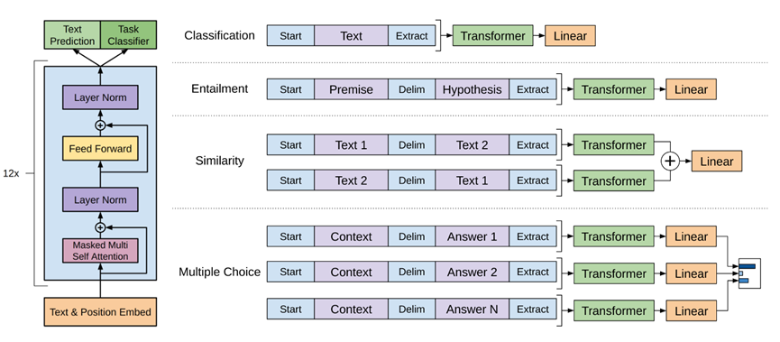

#   GPT的前身：Improving Language Understanding by Generative Pre-Training 论文阅读

# GPT的前身：Improving Language Understanding by Generative Pre-Training 论文阅读

[Improving Language Understanding by Generative Pre-Training](https://s3-us-west-2.amazonaws.com/openai-assets/research-covers/language-unsupervised/language_understanding_paper.pdf)

## 文献简介：

​	《Improving Language Understanding by Generative Pre-Training》这篇文献是由OpenAI的研究团队于2018年6月11日上发表的，截至2023年4月,Google Scholar显示该论文的学术引用量达到5254次，这篇文献是一篇技术报告，没有发表在期刊或会议上，因此没有期（卷）或分区评价。

​	这篇文献的主要贡献是提出了一种基于生成式预训练的语言理解模型，该模型可以在各种自然语言处理任务上取得显著的性能提升。

​	这篇文献的核心思想是先在大规模的无标注文本上预训练一个语言模型，然后在每个具体任务上进行判别式微调，同时利用任务相关的输入变换来实现有效的迁移学习。

 

## 文献内容总结：

​	该文献指出，在当时的NLP领域，与计算机视觉相比，缺乏大量的标注数据集。然而，无标注的文本语料库却非常丰富。因此，作者首先在大量的非标注语料库中进行生成式预训练（Generative Pre-Training），然后针对每个特定的任务进行区分性微调（Discriminative Fine-Tuning）。这种方法使得模型能够在不同的NLP任务上取得很好的表现。

​	该论文采用了半监督（Semi-Supervised）的训练方式，即通过无监督学习进行预训练，再通过监督学习进行微调。在评估了RNN网络和transformer网络之后，作者发现后者可以很好地捕捉较长的语言结构，从而使得模型在处理子任务时具有更好的泛化性。这种方法为模型的训练带来了很好的效果。

#### 	无监督学习下的预训练（Pre-Training）

​	通过输入文本片段 $\mathcal{U}=\{u_1,\ldots,u_n\}$，其中$u_1$可以表示为单个字符，$U$可以表示为一个包含许多字符的字符串，根据前$k$个词来预测下一个词$u_i$的概率$P\left(u_i\middle| u_{i-k},\ldots,u_{i-1}\right)$，然后最大化似然函数来进行训练。目标函数如下所示：
$$
L_1\left(\mathcal{U}\right)=\sum_{i=k+1}^{n}{\log{P}\left(u_i\middle| u_{i-k},\ldots,u_{i-1};\Theta\right)}
$$
​	其中 $k$ 表示给定$k$个词的情况下，通过模型 $\Theta $预测出$u_i $的概率，并将所有出现的词的概率取对数相加作为文本出现的**联合概率**。预训练的目标即为优化该$L_1$目标函数。此外，模型仅使用了Transformer[2]的解码器（Decoder）进行预训练。预测过程涉及将n个词进行词嵌入（Word Embedding），然后加上位置嵌入（Position Embedding）。接下来，文本序列通过多层 Transformer 块进行处理，并在最后一层 Transformer 块后进行最后一次投影。最后，经由 Softmax 操作，输出文本中每个词的概率分布。

#### 监督学习下的微调(fine-tuning)

​	在进行大量无标注的文本语料库训练后，模型还需要在某些特定的目标任务下进行微调。给定文本$ x^1,\ldots,x^m$和相应的标注信息$y$，将它们输入到预训练模型中进行微调。在微调过程中，$h_l^m $表示最后一层 Transformer 块的输出，$W_y$表示最后一层输出层的参数。
$$
P\left(y\mid x^1,\ldots,x^m\right)=softmax\left(h_l^mW_y\right) \\

L_2\left(\mathcal{C}\right)=\sum_{\left(x,y\right)}{\log{P}\left(y\mid x^1,\ldots,x^m\right)}
$$
​	但是作者并不仅仅只将$L_2$作为微调阶段的目标函数，而是采用$L_3\left(\mathcal{C}\right)=L_2\left(\mathcal{C}\right)+\lambda\ast L_1\left(\mathcal{C}\right)$方式，将预训练模型的目标函数加权求和。

#### 特定任务下的微调：

​	图1展示了文中说明的四种特定任务，通过添加的线性层(Linear)，也是上文说的W_y参数，并且不修改transformer的结构来进行微调。

1. 分类 (Classification)：输入开始符(Start)，文本(Text)，抽取符(Extract)，线性层即输出分类数。

2. 包含(Entailment)：输入开始符(Start)，文本(Text)，分隔符(Delim)，假设(Hypothesis)，抽取符(Extract)，线性层输出类似包含，不包含，无关三分类。

3. 相似(Similarity)：输入开始符(Start)，文本(Text 1)，分隔符(Delim)，文本(Text 2)，抽取符(Extract)；输入开始符(Start)，文本(Text2)，分隔符(Delim)，文本(Text1)，抽取符(Extract)。经过相加后进入线性层，输出两端文本在不同语境下是否相似的。

4. 多选(Multiple Choice)：输入开始符(Start)，文本(Context)，分隔符(Delim)，答案(Answer 1)，抽取符(Extract)；输入开始符(Start)，文本(Context)，分隔符(Delim)，答案(Answer N)，抽取符(Extract)；每个输入都经过一个线性层而后通过softmax操作求出每个答案的置信度。

 

#### 实验

​    最后实验是在包含7000篇没有发表的书籍上进行训练，使用12层的transformer解码器，每一层包含768维的网络进行训练，使用了3072维数的FFN(Position-wise Feed-Forward Network)层，使用了Adam优化器和GELU激活函数，其中使用了4000个合并的[3]字节对编码(BPE)，并且在位置嵌入使用了自学习的位置嵌入(learned position embedding)。

## 文献研究内容思考：

#### 为什么GPT模型的网络结果必须采用解码器

GPT预训练模型仅仅只采用transformer的解码器(decoder)，是源于解码器中的第一层多头注意力(Multi-Head Attention)采用了掩码(Masked)的操作，具体操作类似于输入图像只裁剪中间信息，将部分像素通过与掩码矩阵相乘进行消除，使得输出时只能获取未被掩码掉的部分，而论文中采用该方法，将k作为上下文窗口，涂抹掉信息来预测下一个词。这种掩码操作被称为自回归性质，它可以确保模型在生成序列时遵循语言的线性顺序，而不会出现随意跳跃或重复生成的情况。这样，通过大量的文本数据来预训练该模型，可以使其学习到自然语言中的语法结构、词汇等知识。

#### 为什么GPT的位置嵌入没有使用transformer的位置编码

GPT的位置嵌入并没有使用原transformer的正弦函数(sinusoidal)的方式求得。其中transformer提出的方式见如下公式。经过查阅，发现Bert[4]也不是采用transformer的正弦函数，可能自学习的位置嵌入更加贴合数据集，并且目前的单一输入文本长度也不会过长，但在将来越来越大的数据集下，这种可以扩展到无限长度的方式本身具有的泛化性可能会更加有优势。
$$
PE_{\left(pos,2i\right)}=\sin{\left(pos/{10000}^{2i/d}\right)}\\

PE_{\left(pos,2i+1\right)}=\cos{\left(pos/{10000}^{2i/d}\right)}
$$
#### 结论

​    GPT这篇论文奠定了ChatGPT的基础，GPT2论文和GPT3论文主是对预训练方式的改进和不断地增大模型的参数，Instruct GPT[5]提出的RLHF, 就是基于人类反馈（Human Feedback）对语言模型进行强化学习（Reinforcement Learning），人工训练出一个符合人类行为或反馈的奖励模型，然后利用PPO算法进行语言模型的微调，即以强化学习方式依据人类反馈优化语言模型，自此ChatGPT才得以从量的积累到质的改变，并且我猜测这也是ChatGPT能很好避开违法犯罪、种族歧视等话题的一种最为有效的手段。

##### 参考文献：

1. Radford A, Narasimhan K, Salimans T, et al. Improving language understanding by generative pre-training[J]. 2018.

2. Vaswani A, Shazeer N, Parmar N, et al. Attention is all you need[J]. Advances in neural information processing systems, 2017, 30.

3. Sennrich, Rico, Barry Haddow, and Alexandra Birch. "Neural machine translation of rare words with subword units."arXiv preprint arXiv:1508.07909(2015).

4. Devlin J, Chang M W, Lee K, et al. Bert: Pre-training of deep bidirectional transformers for language understanding[J]. arXiv preprint arXiv:1810.04805, 2018.

5. Ouyang L, Wu J, Jiang X, et al. Training language models to follow instructions with human feedback, 2022[J]. URL https://arxiv.org/abs/2203.02155.

6. Lambert, et al., "Illustrating Reinforcement Learning from Human Feedback (RLHF)", Hugging Face Blog, 2022. URL https://huggingface.co/blog/rlhf

   

##### 参考资料：

[**GPT，GPT-2，GPT-3 论文精读【论文精读】**](https://www.bilibili.com/video/BV1AF411b7xQ/?spm_id_from=333.999.0.0&vd_source=7a389f0847a33d335e213d11072e96af)

