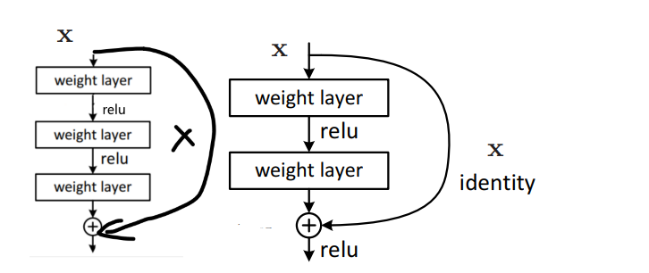
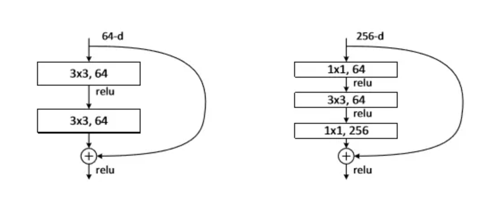
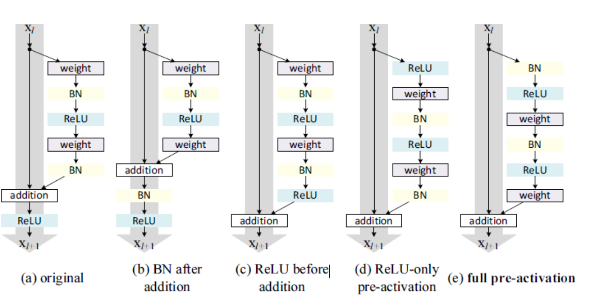
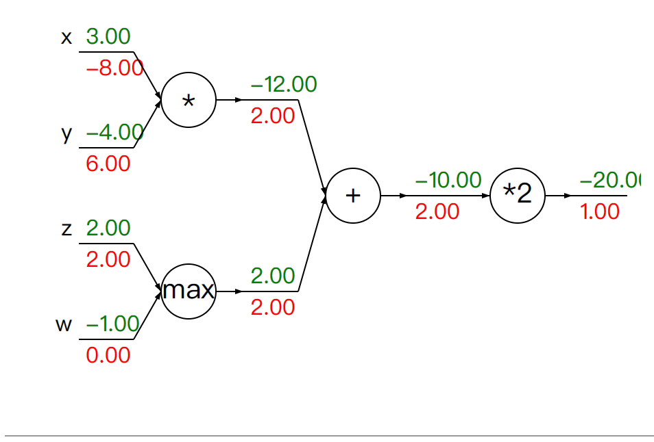
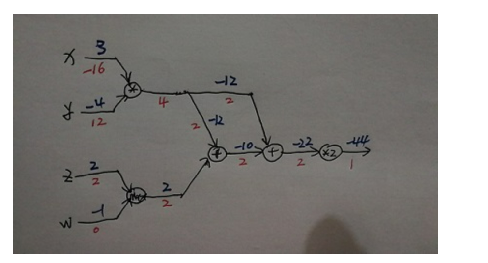

#  残差网络：Deep Residual Learning for Image Recognition论文阅读

# 残差网络：Deep Residual Learning for Image Recognition论文阅读

[**Deep Residual Learning for Image Recognition**](https://openaccess.thecvf.com/content_cvpr_2016/papers/He_Deep_Residual_Learning_CVPR_2016_paper.pdf)


## 文献简介：

这篇论文就是resnet网络的开篇之作，为了解决更深的神经网络更难训练，作者提出了的残差结构，赢得了ILSVRC 2015分类任务的第一名，并且该网络比VGG网络深了八倍，不仅如此，还在物体监测，图像分割上取得了很好的结果。

## Deep Residual Learning for Image Recognition 文献内容总结：

### 介绍

​	深度卷积网络给图像分类任务带来了一系列的突破，网络越深，往往卷积神经网络（CNN）能够提取更多的低、中、高层的特征，而端到端的多层分类器更是可以通过堆叠深度来增加特征的“层次”。那么训练一个好的模型是否和我们假设的一样，堆很多的层数就够了？答案当然没有那么简单，一味地增加网络深度，会使得梯度消失或爆炸。但是解决这个问题目前已经存在一种较好的方法解决，那就是在网络权重初始化，选取合适的初始值，并且在网络的中间层加入一些正则化措施

​	即使解决了梯度爆炸和梯度消失的问题，网络退化问题又随之出现。总所周知，CNN层数越多，越容易出现过拟合，但是作者发现过拟合的并不是导致网络退化的主要原因，因为训练误差无法继续下降了（过拟合现象通常是指训练误差和测试误差相差过大，训练误差表现的更好）。

​	作者先尝试了在浅层网络后加入一个与之对应的恒等映射（identity mapping）层来实现深层的网络，即直接复制前一层的参数，来将网络加深，也就是输入输出是相等的，将权重分成多个部分。理论来说这样只是在浅层网络上扩展为深层，结果应该好于或等于浅层网络，但是实验发现这样这个想法并不可行。原因也很简单，梯度下降算法SGD（文中使用的算法）在多层网络下找不到全局最优解了，越来越深的网络必然使得全局最优解越来越难找到。（SGD的精髓就是能够一直能跑的动，如果哪一天跑不动了，梯度没了就完了，就会卡在一个地方出不去了，所以它的精髓就在于需要梯度够大，要一直能够跑，因为有噪音的存在，所以慢慢的他总是会收敛的，所以只要保证梯度一直够大，其实到最后的结果就会比较好）。

### 残差网络

​	作者就此提出了深度残差学习框架，如下图所示，假设$x$ 是来自浅层网络，在原有的结构中加入了右边的一条链接，实际上这被称为快捷链接（shortcut connection），直接跳过包含权重的两层网络，将$x$输出到下一次激活函数内。

​	在普通的卷积神经网络（CNN）中，我们要输入$x$，然后输出$h(x)$，即$x -> f(x) -> h(x) $，$f(x)$的参数就是我们需要拟合的对象（也就是神经网络拟合的某一层的权重）。但是残差网络中，变成了$x - > f(x) + x -> h(x)$，那么网络拟合的函数不再是CNN中的$h(x)$而是$h(x) -x$ ，因为$f(x) = h(x) -x $，这也就是为什么被称为残差块（residual block）。

​	继续通过简单的证明来说明为什么这样可以消除网络的退化，如下推导过程所示，其中$A^l$是经过残差得来的上一层结果，$A^{l+2}$是输出结果，我们可以看到即使$f(x)$趋近于0，传入下一层的参数由于恒等映射的存在，依然可以保留非线性层的权重。
$$
A^{l+2} = relu(f(z^{l+2} ) + A^{l})\\
 st: z^{l+2} = w^{l+2} * A^{l+2} + b^{l+2}\\
 => A^{l+2} = relu(f(w^{l+2} * A^{l+2} + b^{l+2})+ A^{l})\\
 如果 f(z^{l+2} )  -> 0,  A^{l+2} -> relu(A^{l})\\
 那么经过relu层，只要A^{l} > 0 ，那么就有A^{l+2} -> A^{l}
$$
​	所以就算是在极端情况下，越来越深的网络可能存在一些权重近似为0的堆叠层，由于残差块的作用，我们依然可以保留权重继续优化我们的模型。

​	我们还需要考虑一个问题，那就是捷径链接和输出的维度不同该怎么办，那么我们就需要通过添加额外的$W_s$投影矩阵使得式子变成$y = F(x, \{Wi\}) + W_s*x$，令$F(x, \{Wi\})$维度和$W_s*x$相同，其中$F(x, \{Wi\})$也代表了可以在跨越多个层进行链接，如图所示，当中间的层数为一时，就变成上文提出的式子。



### Bottleneck layer

​	作者在实验中还设计了一个瓶颈层，包含了三层，分别是 1×1、3×3 和 1×1 卷积，其中 1×1 层负责减少然后增加（恢复）维度，使 3x3 层成为输入/输出维度较小的瓶颈，并且证明这两种设计具有相似的时间复杂度。



### 开放性的问题

​	作者认为，深度模型的优化不太可能是由梯度消失引起的。他们训练了没有残差结构的plain网络，使用BN来保证了前向传播的信号具有非零的方差，并且验证了返现传播的梯度在BN中也起了作用，所以前向和反向传播都没有消失，实验结果表明34层的网络依然能取得不错的成绩，说明网络在一定程度上是正常运行的，所以作者猜测难以继续优化的原因是因为加深的网络使得减少训练误差的难度呈现指数级的上升。

### pytoch源码辅助理解

```python
class BasicBlock(nn.Module):
    expansion: int = 1
    def __init__(
        self,
        inplanes: int,
        planes: int,
        stride: int = 1,
        downsample: Optional[nn.Module] = None,
        groups: int = 1,
        base_width: int = 64,
        dilation: int = 1,
        norm_layer: Optional[Callable[..., nn.Module]] = None,
    ) -> None:
        super().__init__()
        if norm_layer is None:
            norm_layer = nn.BatchNorm2d
        if groups != 1 or base_width != 64:
            raise ValueError("BasicBlock only supports groups=1 and base_width=64")
        if dilation > 1:
            raise NotImplementedError("Dilation > 1 not supported in BasicBlock")
        # Both self.conv1 and self.downsample layers downsample the input when stride != 1
        self.conv1 = conv3x3(inplanes, planes, stride) 
        self.bn1 = norm_layer(planes) 
        self.relu = nn.ReLU(inplace=True)
        self.conv2 = conv3x3(planes, planes)
        self.bn2 = norm_layer(planes) 
        self.downsample = downsample # 下采样层
        self.stride = stride

    def forward(self, x: Tensor) -> Tensor:
        identity = x

        out = self.conv1(x) # 卷积层
        out = self.bn1(out) # BN层
        out = self.relu(out) # relu函数

        out = self.conv2(out) # 卷积层
        out = self.bn2(out) # BN层

        if self.downsample is not None:
            identity = self.downsample(x) # 下采样，也就是Identity Mapping

        out += identity
        out = self.relu(out) # relu函数

        return out

```

```python
class Bottleneck(nn.Module):
    expansion: int = 4
    def __init__(
        self,
        inplanes: int,
        planes: int,
        stride: int = 1,
        downsample: Optional[nn.Module] = None,
        groups: int = 1,
        base_width: int = 64,
        dilation: int = 1,
        norm_layer: Optional[Callable[..., nn.Module]] = None,
    ) -> None:
        super().__init__()
        if norm_layer is None:
            norm_layer = nn.BatchNorm2d
        width = int(planes * (base_width / 64.0)) * groups
        # Both self.conv2 and self.downsample layers downsample the input when stride != 1
        self.conv1 = conv1x1(inplanes, width)
        self.bn1 = norm_layer(width)
        self.conv2 = conv3x3(width, width, stride, groups, dilation)
        self.bn2 = norm_layer(width)
        self.conv3 = conv1x1(width, planes * self.expansion)
        self.bn3 = norm_layer(planes * self.expansion)
        self.relu = nn.ReLU(inplace=True)
        self.downsample = downsample
        self.stride = stride

    def forward(self, x: Tensor) -> Tensor:
        identity = x

        out = self.conv1(x) # 1x1 卷积层
        out = self.bn1(out) # BN层
        out = self.relu(out) # relu函数

        out = self.conv2(out) # 3x3 卷积层
        out = self.bn2(out) # BN层
        out = self.relu(out) # relu函数

        out = self.conv3(out) # 1x1 卷积层
        out = self.bn3(out) # BN层

        if self.downsample is not None:
            identity = self.downsample(x)

        out += identity
        out = self.relu(out) # relu函数

        return out

```

​	网络的构造大家可以自行去查看源码，这里只给出残差单元的basic和Bottleneck的框架，pytorch源码阅读应该是相对较为简单，里面也提供了许多版本的resnet。

## 文献研究内容思考：

​	后续这篇论文作者通过分析残差块(residual block)背后的传播公式，通过一系列的消融实验(ablation experiments)来确定了恒等映射的重要性，并提出来新的残差单元(residual unit)，使得训练更加简单，并且提高模型的泛化能力。代码位于：https://github.com/KaimingHe/resnet-1k-layers。并且两篇论文均是来自微软研究院，都出自Kaiming He, Xiangyu Zhang, Shaoqing Ren, 和 Jian Sun。作者也设计了多种消融实验，并分析其结果，如下图所示，其中也通过推导来证明为什么一定要满足恒等映射。



### 为什么模型不会出现过拟合？

> ​	CIFAR数据集比较小，但是在1000层的网络架构下仍然没有过拟合。

​	尽管深度模型具有许多参数和复杂的结构，但由于其内在设计的缘故，模型的复杂度实际上并不高。事实上，引入残差连接可以降低模型的复杂度，从而减轻过拟合的问题。降低模型复杂度并不意味着无法表示其他信息，而是可以找到一个更简单的模型来拟合数据。例如，即使没有残差连接，理论上也可能学习到某种恒等变换，但实际上这是不可行的，因为没有指导整个网络的信息流向，从而导致难以实现。因此，手动将这种变换引入模型中，使其更易于训练，相当于降低了模型的复杂度。

### 正向与反向传播

图中$x,y,z,w$表示初始值，每一条线的绿色数字代表着正向传播的参数，红色代表的是反向传播的参数，每一个圆圈代表一次运算，其中的符号或数字代表着计算方式。



我再给出添加了残差块的例子，希望这个图可以帮助理解残差网络的反向传播



### 总结

​	残差网络的提出到目前为止，已经有超过90%的网络在使用基于跳跃连接的网络，根据该结构的灵感，提出了各式各样的网络结果，例如 LSTNet中上，类似的设计了循环跳跃层来跳过部分信息流，在RNN处理时序相关的问题时，也提出了相似的结构来跳过部分时间帧。


##### 参考文献：

[Identity Mappings in Deep Residual Networks](https://arxiv.org/pdf/1603.05027.pdf)

##### 参考资料：

[ResNet论文逐段精读【论文精读】](https://www.bilibili.com/video/BV1P3411y7nn/?vd_source=7a389f0847a33d335e213d11072e96af)

[Residual Blocks in Deep Learning](https://towardsdatascience.com/residual-blocks-in-deep-learning-11d95ca12b00)

[pytorch的resnet源代码](https://github.com/pytorch/vision/blob/main/torchvision/models/resnet.py)

[Gradient backpropagation through ResNet skip connections](https://stats.stackexchange.com/questions/268820/gradient-backpropagation-through-resnet-skip-connections)

https://cs231n.github.io/optimization-2/
