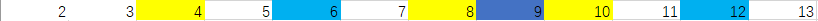

# 质数


<!--more-->

> 质数又称素数。 **一个大于1的自然数，除了1和它自身外，不能被其他自然数整除的数叫做质数**；

本文介绍三种求质数的方法，第一种是基于常规求解的改进，第二种和第三种则是求质数的两种特殊方法。

## 第一种：简单遍历

遍历循环所有情况

ps : 因为因数是成对出现的，一个小于等于算数平方根，另外一个大于等于算数平方根。

代码如下：

```c++
 vector<int> prime(int n)
    {
        vector<int> res;
        for (int i = 0; i <= n; i++)
        {
            int flag = 0;
            for (int j = 0; j <= sqrt(i); j++)
            {
                if (i % j == 0)
                {
                    flag = 1;
                    break;
                }
            }
            if (flag == 0)
            {
                res.push_back(i);
            }
        }
        return res;
    }
```

```go
func prime(n int) (res []int) {
	for i := 2; i <= n; i++ {
		flag := 0
		for j := 2; j <= int(math.Sqrt(float64(i))); j++ {
			if i%j == 0 {
				flag = 1
				break
			}
		}
		if flag == 0 {
			res = append(res, i)
		}
	}
	return
}
```

## 第二种：埃氏筛

> **OI Wiki**  
>
> 考虑这样一件事情：对于任意一个大于$i$的正整数 ，那么它的$x$倍就是合数（$x>1$)。利用这个结论，我们可以避免很多次不必要的检测。如果我们从小到大考虑每个数，然后同时把当前这个数的所有（比自己大的)倍数记为合数，那么运行结束的时候没有被标记的数就是素数了。

利用图来表示就是



从头遍历，将该数的倍数全部划去，例如2划去4,6,8,10,12，而到3时继续划去6,9,12，4由于被划去不进行遍历，5没被前面的数划掉，所以也是质数，以此类推，13以内的数可以得出2,3,5,7,11,13为质数。

代码如下：

```c++
vector<bool> prime(int n){
        vector<bool> isPrime(n + 1, true);
        isPrime[0] = isPrime[1] = false;
        for(int i = 2; i <= n; i++){
            if(isPrime[i]) {
                if((long long)i * i <= n)
                    for(int j = i * i; j <= n; j += i) isPrime[j] = false;
            }
        }
        return isPrime;
    }
```

```go
func prime(n int) (res []bool) {
	res = make([]bool, n+1)
	for i := range res {
		res[i] = true
	}
	res[0], res[1] = false, false
	for i := 2; i <= n; i++ {
		if res[i] {
			if i*i <= n {
				for j := i * i; j <= n; j += i {
					res[j] = false
				}
			}
		}
	}
	return
```

时间复杂度为$O(n\log{\log{n}})$

## 第三种：线性筛（欧拉筛）

每个回合只被划掉一次，每次只被最小的质因子划去

每个数从小到大乘上已经存在的质数，若可以被某个数整除就跳出循环，那么每个已经存在的质数都是x的最小质因子

```c++
vector<int> prime(int n){
        vector<int> res;
        vector<bool> isPrime(n + 1, true);
        for(int i = 2; i <= n; i++){
            if(isPrime[i]){
                res.push_back(i);
            }
            for(auto a : res){
                if(a * i > n) break;
                isPrime[a*i] = false;
                if(i % a == 0) break;
            }
        }
        return res;
    }

```

```go
func prime(n int) (res []int) {
	isPrime := make([]bool, n+1)
	for i := range isPrime {
		isPrime[i] = true
	}
	for i := 2; i <= n; i++ {
		if isPrime[i] {
			res = append(res, i)
		}
		for _, x := range res {
			if x*i > n {
				break
			}
			isPrime[x*i] = false
			if i%x == 0 {
				break
			}
		}
	}
	return
```

时间复杂度为$O(n)$

